# Blazor Puzzle #13

## Upgrade This App!

YouTube Video: https://www.youtube.com/watch?v=fxGEVS2Gcyo&list=PLdo4fOcmZ0oULyHSPBx-tQzePOYlhvrAU&index=64

BlazorPuzzle Home Page: https://blazorpuzzle.com

### The Challenge:

In this episode, Carl and Jeff show a Blazor Server app that accesses data and displays it in a grid. The challenge is to upgrade it to a .NET 8 Blazor Web App with the Auto Interactive mode.

### The Solution:

The first step is to change the Target Framework in the project file from 7 to 8:

```xml
<TargetFramework>net8.0</TargetFramework>
```

To really turn this into a Blazor Web App with Auto mode, we need to make some serious changes.

Add a new Blazor WebAssembly Empty project to the solution called **Puzzle13.Client**

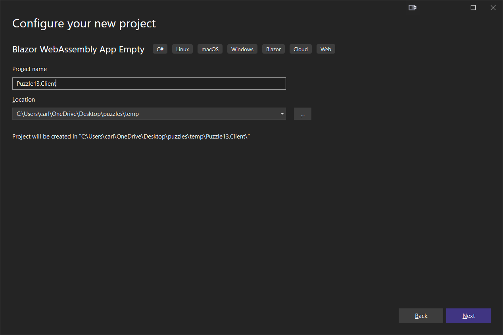

Make sure to de-select **ASP.NET Core Hosted** and **Progressive Web Application**:

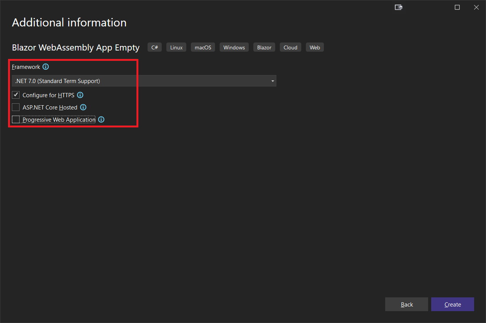

Add a project reference from the server project to the client project.

Change the *Puzzle13.Client.csproj* file to this:

```xml
<Project Sdk="Microsoft.NET.Sdk.BlazorWebAssembly">

	<PropertyGroup>
		<TargetFramework>net8.0</TargetFramework>
		<ImplicitUsings>enable</ImplicitUsings>
		<Nullable>enable</Nullable>
		<NoDefaultLaunchSettingsFile>true</NoDefaultLaunchSettingsFile>
		<StaticWebAssetProjectMode>Default</StaticWebAssetProjectMode>
	</PropertyGroup>

	<ItemGroup>
		<PackageReference Include="Microsoft.AspNetCore.Components.QuickGrid" Version="8.0.2" />
		<PackageReference Include="Microsoft.AspNetCore.Components.WebAssembly" Version="8.0.2" />
		<PackageReference Include="Microsoft.Extensions.Http" Version="8.0.0" />
	</ItemGroup>

</Project>
```

Now change the server project's *csproj* file to this:

```xml
<Project Sdk="Microsoft.NET.Sdk.Web">

	<PropertyGroup>
		<TargetFramework>net8.0</TargetFramework>
		<Nullable>enable</Nullable>
		<ImplicitUsings>enable</ImplicitUsings>
	</PropertyGroup>

	<ItemGroup>
		<PackageReference Include="Microsoft.AspNet.WebApi.Core" Version="5.3.0" />
		<PackageReference Include="Microsoft.AspNetCore.Components.QuickGrid" Version="8.0.2" />
		<PackageReference Include="Microsoft.AspNetCore.Components.WebAssembly.Server" Version="8.0.2" />
	</ItemGroup>

	<ItemGroup>
		<ProjectReference Include="..\Puzzle13.Client\Puzzle13.Client.csproj" />
</ItemGroup>

</Project>
```

> :point_up: Always check for updates with the NuGet package manager after pasting package references

From the client project, remove the *wwwroot* and *Properties* folders:

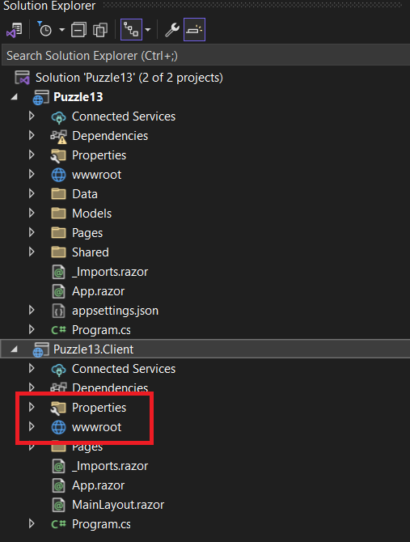

Next, add a *Layout* folder to the client project:

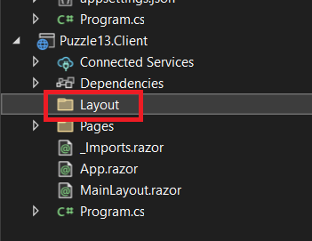

Drag *MainLayout.razor* from the server's *Shared* folder to the *Layout* folder in the client.

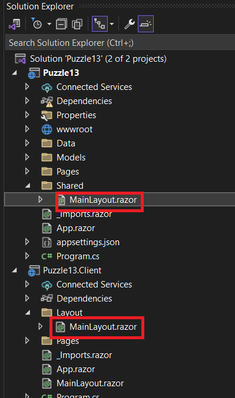

Now, delete the *Shared* folder in the server project:

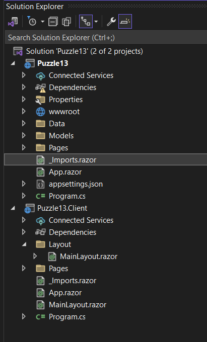

Next, remove *App.razor*, and the root-level *MainLayout.razor* from the client project, and rename *Index.razor* to *Home.razor*

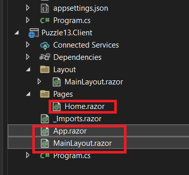

In the server project, remove the *Models* folder, add a *Components* folder, and move the *Pages* folder to be under *Components*:

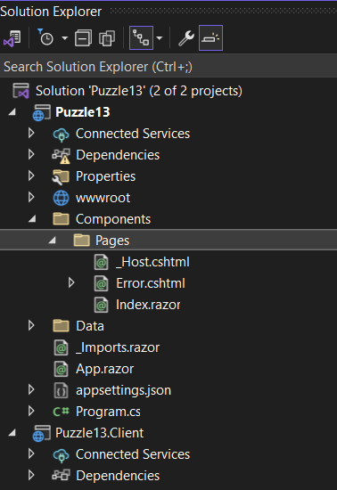

Next, move *_Imports.razor* to *Components*

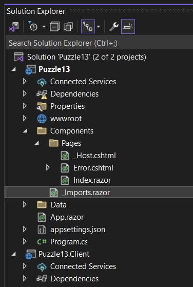

Next, rename *App.razor* to *Routes.razor* and move it to the client project:

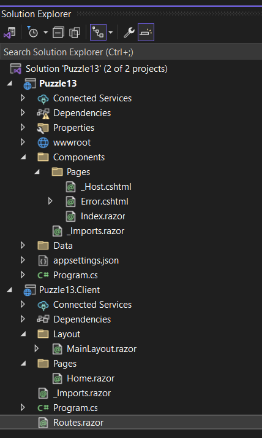

In the server project, rename *Components\Pages\\\_Host.cshtml* to *App.razor* and move it into the *Components* folder:

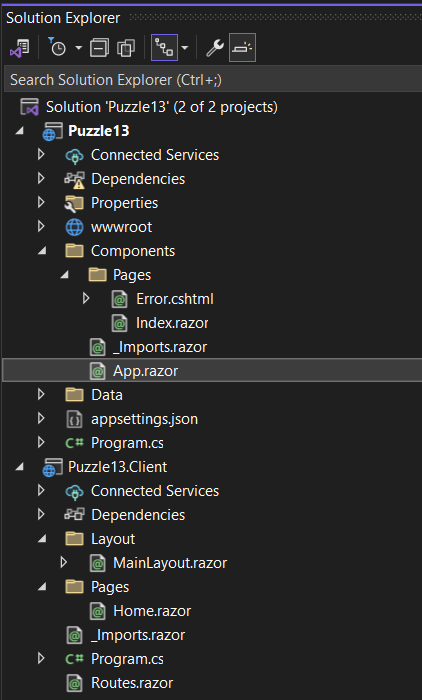

Add a *Models* folder to the client project and add the following class:

*dtoPerson.cs*:

```c#
public class dtoPerson
{
    public int Id { get; set; }
    public string FirstName { get; set; } = string.Empty;
    public string LastName { get; set; } = string.Empty;
    public string Bio { get; set; } = string.Empty;
    public string PhotoUrl { get; set; } = string.Empty;
}
```

Your Solution Explorer should look like this:

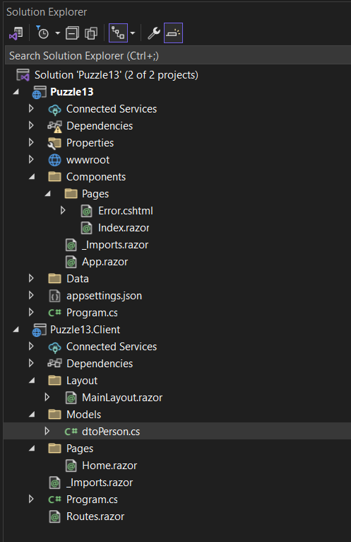

In the server project's *Data* folder, rename *PersonsManager.cs* to *PersonManager.cs* (not plural) and also change the class in the code.

Then update the code to use `dtoPerson` instead of *Person*:

*PersonManager.cs*:

```c#
namespace Puzzle13.Data;

public static class PersonManager
{
    private static List<dtoPerson> people = new();
    
    public static List<dtoPerson> GetAllPeople()
    {
        if (people.Count == 0)
        {
            var peopleFile = $"{Environment.CurrentDirectory}\\Data\\people.json";
            if (!File.Exists(peopleFile)) 
                return people;
            var json = File.ReadAllText(peopleFile);
            var allPeople = JsonSerializer.Deserialize<List<dtoPerson>>(json);
            people.AddRange(allPeople);
        }
        return people;
    }
}
```

On the server, add a *Controllers* folder, and add the following class:

*PersonController.cs*:

```c#
using Microsoft.AspNetCore.Mvc;
using Puzzle13.Data;

namespace Puzzle13.Controllers;

[Route("api/[controller]")]
[ApiController]
public class PersonController : Controller
{

    [HttpGet]
    public List<dtoPerson> GetAll()
    {
        var people = PersonManager.GetAllPeople();
        return people;
    }
}
```

In the client project, add a *Services* folder, and to it add the following class:

*ApiService.cs*:

```c#
using System.Diagnostics;
using System.Net.Http.Json;

namespace Puzzle13.Client.Services;

public class ApiService
{
    private readonly HttpClient _httpClient;

    public ApiService(HttpClient httpClient)
    {
        _httpClient = httpClient;
    }

    public async Task<List<dtoPerson>> GetPeopleAsync()
    {
        if (_httpClient.BaseAddress == null)
        {
            return new List<dtoPerson>();
        }

        Debug.WriteLine($"BaseAddress: {_httpClient.BaseAddress}");
        
        var response = await _httpClient.GetAsync("api/person");
        if (response.IsSuccessStatusCode)
        {
            var people = await response.Content.ReadFromJsonAsync<List<dtoPerson>>();
            return people;
        }
        return new List<dtoPerson>();
    }
}
```

On the server, rename *Error.cshtml* to *Error.razor* and remove the code behind file:

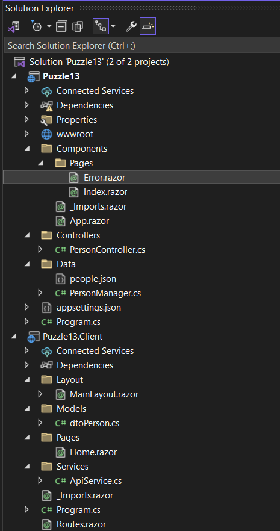

Replace the contents of *Error.razor* with the default template markup and code:

*Error.razor*:

```c#
@page "/Error"
@using System.Diagnostics

<PageTitle>Error</PageTitle>

<h1 class="text-danger">Error.</h1>
<h2 class="text-danger">An error occurred while processing your request.</h2>

@if (ShowRequestId)
{
    <p>
        <strong>Request ID:</strong> <code>@RequestId</code>
    </p>
}

<h3>Development Mode</h3>
<p>
    Swapping to <strong>Development</strong> environment will display more detailed information about the error that occurred.
</p>
<p>
    <strong>The Development environment shouldn't be enabled for deployed applications.</strong>
    It can result in displaying sensitive information from exceptions to end users.
    For local debugging, enable the <strong>Development</strong> environment by setting the <strong>ASPNETCORE_ENVIRONMENT</strong> environment variable to <strong>Development</strong>
    and restarting the app.
</p>

@code{
    [CascadingParameter]
    private HttpContext? HttpContext { get; set; }

    private string? RequestId { get; set; }
    private bool ShowRequestId => !string.IsNullOrEmpty(RequestId);

    protected override void OnInitialized() =>
        RequestId = Activity.Current?.Id ?? HttpContext?.TraceIdentifier;
}
```

Modify *App.razor* as follows:

Remove the top 4 lines:

```
@page "/"
@using Microsoft.AspNetCore.Components.Web
@namespace Puzzle13.Pages
@addTagHelper *, Microsoft.AspNetCore.Mvc.TagHelpers
```

In the header, change this:

```xml
<base href="~/" />
```

to this:

```xml
<base href="/" />
```

removing the tilde.

Next, change this line:

```xml
<component type="typeof(HeadOutlet)" render-mode="ServerPrerendered" />
```

to this:

```xml
<HeadOutlet @rendermode="@InteractiveAuto" />
```

Change this line:

```xml
<component type="typeof(App)" render-mode="ServerPrerendered" />
```

to point to Routes:

```xml
<Routes @rendermode="@InteractiveAuto" />
```

Remove the Error UI:

```html
<div id="blazor-error-ui">
    <environment include="Staging,Production">
        An error has occurred. This application may no longer respond until reloaded.
    </environment>
    <environment include="Development">
        An unhandled exception has occurred. See browser dev tools for details.
    </environment>
    <a href="" class="reload">Reload</a>
    <a class="dismiss">🗙</a>
</div>
```

Change the script tag from this:

```html
<script src="_framework/blazor.server.js"></script>
```

to this:

```xml
<script src="_framework/blazor.web.js"></script>
```

Now let's modify *Routes.razor* in the client project:

First, remove the `<NotFound>` section. It's obsolete:

```xml
<NotFound>
    <PageTitle>Not found</PageTitle>
    <LayoutView Layout="@typeof(MainLayout)">
        <p role="alert">Sorry, there's nothing at this address.</p>
    </LayoutView>
</NotFound>
```

Change the word `App` to `Program`, and change the layout reference from `MainLayout` to `Layout.MainLayout`:

```xml
<Router AppAssembly="@typeof(Program).Assembly">
    <Found Context="routeData">
        <RouteView RouteData="@routeData" DefaultLayout="@typeof(Layout.MainLayout)" />
        <FocusOnNavigate RouteData="@routeData" Selector="h1" />
    </Found>
</Router>
```

#### Now let's change *Layout\MainLayout* on the client to this:

```xml
@inherits LayoutComponentBase

<div class="page">
    <main>
        <article class="content px-4">
            @Body
        </article>
    </main>
</div>

<div id="blazor-error-ui">
    An unhandled error has occurred.
    <a href="" class="reload">Reload</a>
    <a class="dismiss">🗙</a>
</div>
```

The Error UI has moved into the main layout.

#### Server Configuration

Make the following changes to *Program.cs*:

Replace .NET 7 Services with .NET 8 code, and add additional config.

Replace these two lines:

```c#
builder.Services.AddRazorPages();
builder.Services.AddServerSideBlazor();
```

with this:

```c#
builder.Services.AddRazorComponents()
    .AddInteractiveServerComponents()
    .AddInteractiveWebAssemblyComponents();

// Configure your HttpClient with a local base address for debugging
builder.Services.AddHttpClient("Puzzle13.ServerAPI", client =>
{
    // Replace with your API's local address and port
    client.BaseAddress = new Uri("https://localhost:7148/");
    // Additional configurations
});

builder.Services.AddScoped(sp =>
    sp.GetRequiredService<IHttpClientFactory>().CreateClient("Puzzle13.ServerAPI"));

builder.Services.AddScoped<ApiService>();

builder.Services.AddControllers();
```

Replace the magic number **7148** with your SSL port, which you can find in *Properties\launchSettings.json*:

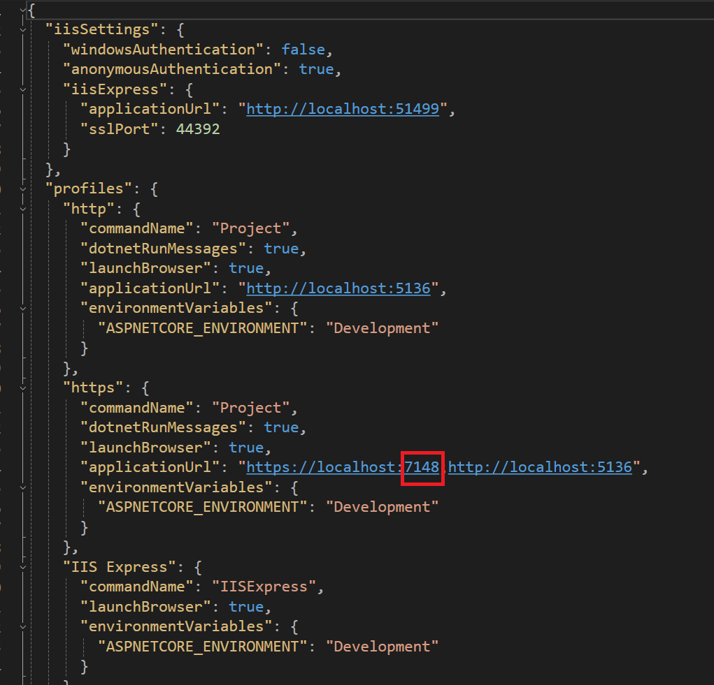

In the pipeline, replace these three lines:

```c#
app.UseRouting();

app.MapBlazorHub();
app.MapFallbackToPage("/_Host");
```

with this:

```c#
app.UseAntiforgery();

app.MapControllers();

app.MapRazorComponents<App>()
    .AddInteractiveServerRenderMode()
    .AddInteractiveWebAssemblyRenderMode()
    .AddAdditionalAssemblies(typeof(Puzzle13.Client._Imports).Assembly);
```

In the server projects's *Imports.razor* file, remove this line:

```
@using Puzzle13.Shared
```

and add the following:

```
@using static Microsoft.AspNetCore.Components.Web.RenderMode
@using System.Net.Http.Json
@using Puzzle13.Client
@using Puzzle13.Components
```

### Client Configuration

In the client project's *Imports.razor* file, remove this line:

```
@using Microsoft.AspNetCore.Components.WebAssembly.Http
```

and add the following:

```
@using static Microsoft.AspNetCore.Components.Web.RenderMode
@using Microsoft.AspNetCore.Components.Forms
@using Microsoft.AspNetCore.Components.Web.Virtualization
@using System.Text.Json
@using Puzzle13.Client.Services
```

Replace the client's *Program.cs* with the following:

```c#
using Microsoft.AspNetCore.Components.WebAssembly.Hosting;
using Puzzle13.Client.Services;

var builder = WebAssemblyHostBuilder.CreateDefault(args);

builder.Services.AddHttpClient("Puzzle13.ServerAPI",
    client => client.BaseAddress = new Uri(builder.HostEnvironment.BaseAddress));

builder.Services.AddScoped(sp =>
    sp.GetRequiredService<IHttpClientFactory>().CreateClient("Puzzle13.ServerAPI"));

builder.Services.AddScoped<ApiService>();

await builder.Build().RunAsync();
```

Copy the contents of the server project's *Index.razor* to the client project's *Home.razor*:

```c#
@page "/"
@using Microsoft.AspNetCore.Components.QuickGrid

<style>
    .cell-style {
        vertical-align: top;
    }

    .quick-grid tr:nth-child(odd) {
        background-color: #f2f2f2; /* Light grey for odd rows */
        padding-bottom: 10px;
    }

    .quick-grid tr:nth-child(even) {
        background-color: white; /* White for even rows */
        padding-bottom: 10px;
    }
</style>

<PageTitle>Puzzle 13</PageTitle>

@if (people == null)
{
    <p>
        This is a .NET 7 Blazor Server app that loads 5000 people from a JSON file 
        and displays them in a QuickGrid.
    </p>
    <p>
        Your job is to upgrade this project to a .NET 8 Blazor Web App using the new Auto Render Mode.
    </p>
    <p>
        You will need to use the latest NuGet packages for Blazor and QuickGrid, and you will
        need to keep the person data on the server, and not expose the ForeignKey property to the client.
    </p>

    <button @onclick="LoadPeople">Load All People</button>
}
else
{
    <Paginator Value="@pagination" />
    <QuickGrid class="quick-grid"
               Items="@itemsQueryable"
               Pagination="@pagination">
        <PropertyColumn Property="@(p => p.FirstName)" 
                        Title="First Name" 
                        Sortable="true"
                        Class="cell-style" />
        <PropertyColumn Property="@(p => p.LastName)" 
                        Title="Last Name" 
                        Sortable="true"
                        Class="cell-style" />
        <PropertyColumn Property="@(p => p.Bio)" 
                        Title="Bio" 
                        Sortable="true"
                        Class="cell-style" />
        <TemplateColumn Title="Photo" 
                        Class="cell-style">
            @{
                var item = context as Person;
                
            }
        </TemplateColumn>
    </QuickGrid>
}

@code
{
    List<Person> people = null;
    PaginationState pagination = new PaginationState { ItemsPerPage = 10 };
    IQueryable<Person>? itemsQueryable;

    void LoadPeople()
    {
        people = PersonsManager.GetAllPeople();
        itemsQueryable = people.AsQueryable();
    }

    protected override void OnInitialized()
    {

    }
}
```

Now, delete *Index.razor* from the server project.

Let's modify this page to bring it up to date. Replace with the following:

```c#
@page "/"
@using Microsoft.AspNetCore.Components.QuickGrid
@inject ApiService apiService

<style>
    .cell-style {
        vertical-align: top;
    }

    .quick-grid tr:nth-child(odd) {
        background-color: #f2f2f2; /* Light grey for odd rows */
        padding-bottom: 10px;
    }

    .quick-grid tr:nth-child(even) {
        background-color: white; /* White for even rows */
        padding-bottom: 10px;
    }
</style>

<PageTitle>Puzzle 13 Upgrade</PageTitle>
<h1>Platform: @platform</h1>
<br />

@if (people == null)
{
    <button disabled=@buttonDisabled @onclick="LoadPeople">Load All People</button>
}
else if (people.Count == 0)
{
    <p><em>Loading...</em></p>
}
else
{
    <button disabled=@buttonDisabled @onclick="LoadPeople">Reload People</button>
    <br/>
    <br/>
    <Paginator State="@pagination" />
    <QuickGrid Class="quick-grid"
               Items="@itemsQueryable"
               Pagination="@pagination">
        <PropertyColumn Property="@(p => p.FirstName)" 
                        Title="First Name" 
                        Sortable="true"
                        Class="cell-style" />
        <PropertyColumn Property="@(p => p.LastName)" 
                        Title="Last Name" 
                        Sortable="true"
                        Class="cell-style" />
        <PropertyColumn Property="@(p => p.Bio)" 
                        Title="Bio" 
                        Sortable="true"
                        Class="cell-style" />
        <TemplateColumn Title="Photo" 
                        Class="cell-style">
            @{
                var item = context as dtoPerson;
                
            }
        </TemplateColumn>
    </QuickGrid>
}

@code
{
    List<dtoPerson> people = null;
    PaginationState pagination = new PaginationState { ItemsPerPage = 10 };
    IQueryable<dtoPerson>? itemsQueryable;
    bool buttonDisabled = true;
    string platform = "SSR";

    async Task LoadPeople()
    {
        buttonDisabled = true;
        if (people != null)
            people.Clear();

        await InvokeAsync(StateHasChanged);

        people = await apiService.GetPeopleAsync();
        itemsQueryable = people.AsQueryable();
        buttonDisabled = false;
    }

    protected override void OnAfterRender(bool firstRender)
    {
        if (firstRender)
        {
            platform = (OperatingSystem.IsBrowser() ? "Wasm" : "Server");
            StateHasChanged();
            buttonDisabled = false;
        }
    }
}
```

Check out the code in `OnAfterRender`. Whenever a render happens, we check to see if the code is running on the client or the server. We save that into a variable, `platform`, which is displayed at the top of the page. `platform` is initialized to "SSR" (server-side-rendered).

We changed `Person` to `dtoPerson`.

The `LoadPeople()` method was changed to use the ApiService.

We added a `buttonDisabled` bool to keep the button disabled until we have rendered, and then again when loading the data.

We deleted the text at the top of the page, and also added a condition to show *Loading...* if people.count is zero.

In the release version of QuickGrid, the `Paginator`'s `Value` parameter changed to `State`, and `Class` is now a fully qualified parameter, so we made those changes.

